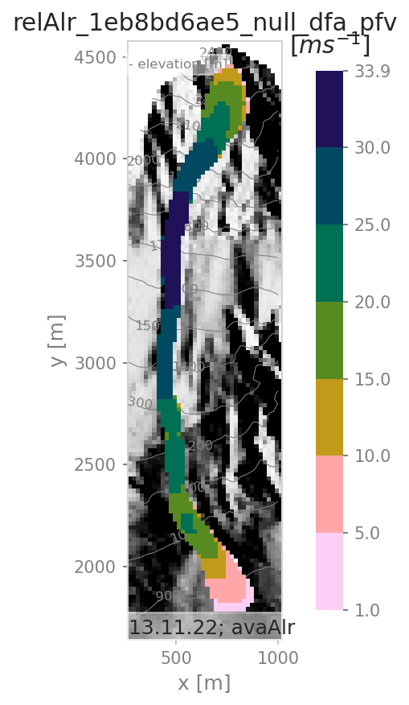

# com1DFA Simulation 
 
### Avalanche directory: *data/avaAlr* 
 
### Simulation name: *relAlr_c164d20045_ent_dfa* 
 
### Date: 13/11/2022 13:02:45 
 
### Simulation Parameters 
 
| Parameters | Values | 
| ---------- | ------ | 
| Program version | 1.3+6.g1e78e33a.dirty | 
| Parameter set |  | 
| Release Area Scenario | relAlr | 
| Entrainment | Yes | 
| Resistance | No | 
| Parameter variation on |  | 
| Parameter value |  | 
| Mu | 0.155 | 
| Density [kgm-3] | 200 | 
| Friction model | samosAT | 
| Initial mass [kg] | 10113566.21 | 
| Final mass [kg] | 13431017.45 | 
| Entrained mass [kg] | 3317451.23 | 
| Entrained volume [m3] | 33174.51 | 
| Stop criterion | < 1.00 percent of PKE | 
| Avalanche run time [s] | 221.10 | 
| Computation time [s] | 45.78 | 
 
### Release Area 
 
| Release area scenario | Release Area | Release thickness [m] | Projected Area [m2] | Actual Area [m2] | 
| ----------| ----------| ----------| ----------| ----------| 
| relAlr | ['AlR'] | [1.0] | 55200.00 | 68465.80 | 
 
### Entrainment area 
 
| Entrainment area scenario | Entrainment thickness [m] | Entrainment density [kgm-3] | 
| ----------| ----------| ----------| 
| entAlr.shp | [0.3] | 100 | 
 
### Simulation Results 
 
##### Figure:   pft 
 
 
 
 
##### Figure:   pfv 
 
 
 
 
##### Figure:   ppr 
 
 
 
 
# com1DFA Simulation 
 
### Avalanche directory: *data/avaAlr* 
 
### Simulation name: *relAlr_1eb8bd6ae5_null_dfa* 
 
### Date: 13/11/2022 13:03:25 
 
### Simulation Parameters 
 
| Parameters | Values | 
| ---------- | ------ | 
| Program version | 1.3+6.g1e78e33a.dirty | 
| Parameter set |  | 
| Release Area Scenario | relAlr | 
| Entrainment | No | 
| Resistance | No | 
| Parameter variation on |  | 
| Parameter value |  | 
| Mu | 0.155 | 
| Density [kgm-3] | 200 | 
| Friction model | samosAT | 
| Initial mass [kg] | 10113566.21 | 
| Final mass [kg] | 10113566.21 | 
| Entrained mass [kg] | 0.00 | 
| Entrained volume [m3] | 0.00 | 
| Stop criterion | < 1.00 percent of PKE | 
| Avalanche run time [s] | 232.80 | 
| Computation time [s] | 38.66 | 
 
### Release Area 
 
| Release area scenario | Release Area | Release thickness [m] | Projected Area [m2] | Actual Area [m2] | 
| ----------| ----------| ----------| ----------| ----------| 
| relAlr | ['AlR'] | [1.0] | 55200.00 | 68465.80 | 
 
### Simulation Results 
 
##### Figure:   pft 
 
 
 
 
##### Figure:   pfv 
 
 
 
 
##### Figure:   ppr 
 
 
 
 
