# com1DFA Simulation 
 
### Avalanche directory: *data/avaGar* 
 
### Simulation name: *relGar_f9a98d3d16_ent_dfa* 
 
### Date: 26/10/2022 15:16:31 
 
### Simulation Parameters 
 
| Parameters | Values | 
| ---------- | ------ | 
| Program version | 1.3+6.g1e78e33a.dirty | 
| Parameter set |  | 
| Release Area Scenario | relGar | 
| Entrainment | Yes | 
| Resistance | No | 
| Parameter variation on |  | 
| Parameter value |  | 
| Mu | 0.155 | 
| Density [kgm-3] | 200 | 
| Friction model | samosAT | 
| Initial mass [kg] | 12299877.93 | 
| Final mass [kg] | 37679652.03 | 
| Entrained mass [kg] | 3392955.13 | 
| Entrained volume [m3] | 33929.55 | 
| Stop criterion | < 1.00 percent of PKE | 
| Avalanche run time [s] | 110.80 | 
| Computation time [s] | 70.12 | 
 
### Release Area 
 
| Release area scenario | Release Area | Release thickness [m] | Projected Area [m2] | Actual Area [m2] | 
| ----------| ----------| ----------| ----------| ----------| 
| relGar | ['GaR1'] | [1.2] | 44250.00 | 55932.69 | 
 
### Entrainment area 
 
| Entrainment area scenario | Entrainment thickness [m] | Entrainment density [kgm-3] | 
| ----------| ----------| ----------| 
| entGar.shp | [0.3] | 100 | 
 
### Simulation Results 
 
##### Figure:   pft 
 
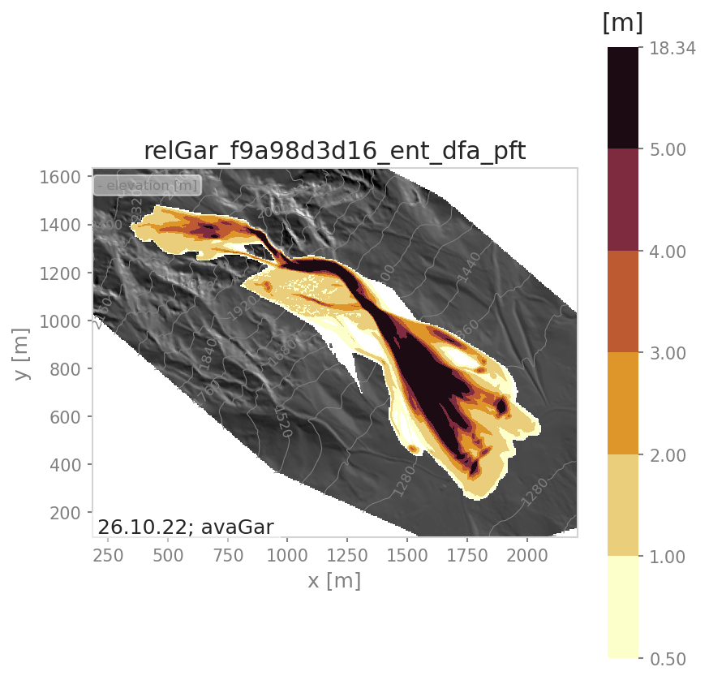 
 
 
##### Figure:   pfv 
 
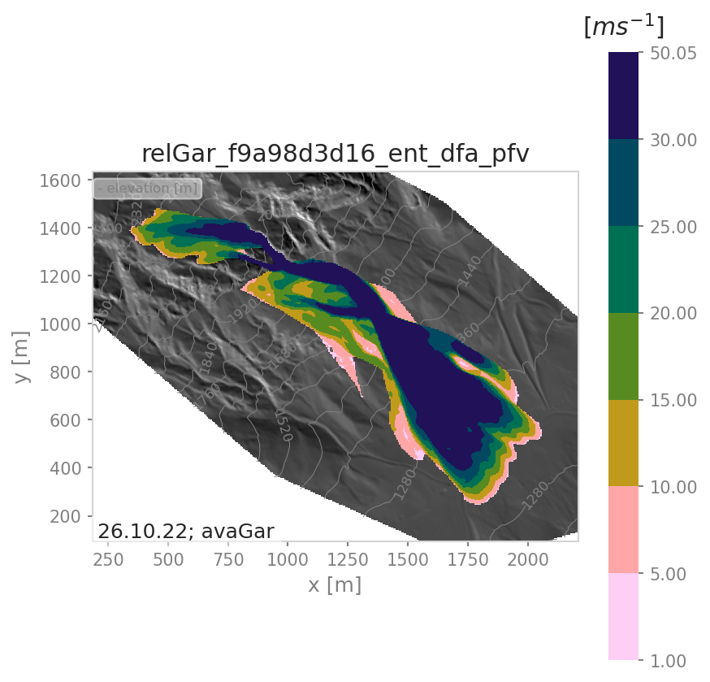 
 
 
##### Figure:   ppr 
 
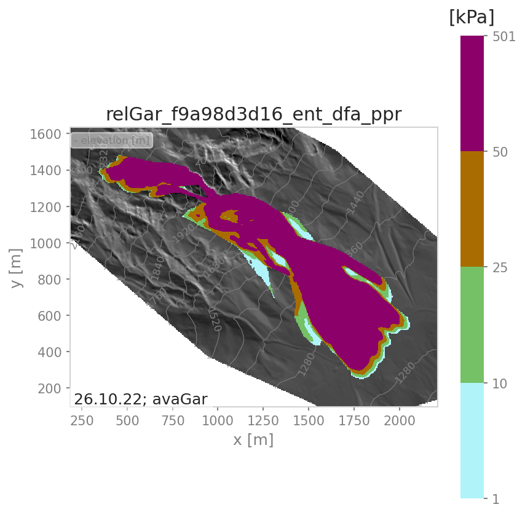 
 
 
# com1DFA Simulation 
 
### Avalanche directory: *data/avaGar* 
 
### Simulation name: *relGar_4e45a18a6f_null_dfa* 
 
### Date: 26/10/2022 15:17:42 
 
### Simulation Parameters 
 
| Parameters | Values | 
| ---------- | ------ | 
| Program version | 1.3+6.g1e78e33a.dirty | 
| Parameter set |  | 
| Release Area Scenario | relGar | 
| Entrainment | No | 
| Resistance | No | 
| Parameter variation on |  | 
| Parameter value |  | 
| Mu | 0.155 | 
| Density [kgm-3] | 200 | 
| Friction model | samosAT | 
| Initial mass [kg] | 12299877.93 | 
| Final mass [kg] | 34286696.91 | 
| Entrained mass [kg] | 0.00 | 
| Entrained volume [m3] | 0.00 | 
| Stop criterion | < 1.00 percent of PKE | 
| Avalanche run time [s] | 113.20 | 
| Computation time [s] | 69.42 | 
 
### Release Area 
 
| Release area scenario | Release Area | Release thickness [m] | Projected Area [m2] | Actual Area [m2] | 
| ----------| ----------| ----------| ----------| ----------| 
| relGar | ['GaR1'] | [1.2] | 44250.00 | 55932.69 | 
 
### Simulation Results 
 
##### Figure:   pft 
 
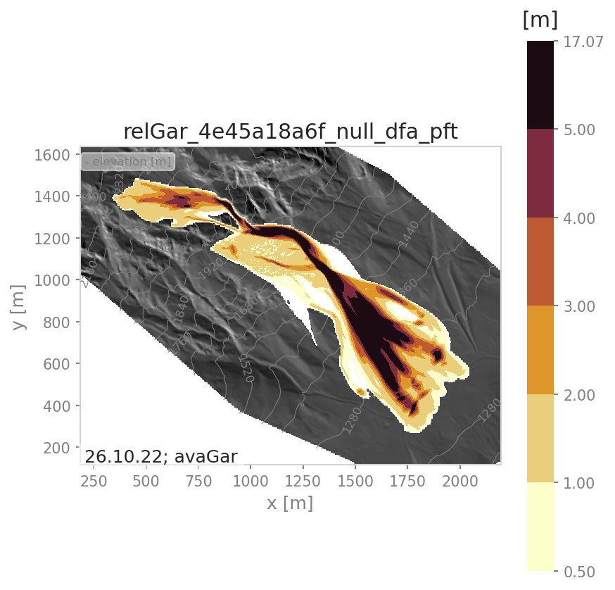 
 
 
##### Figure:   pfv 
 
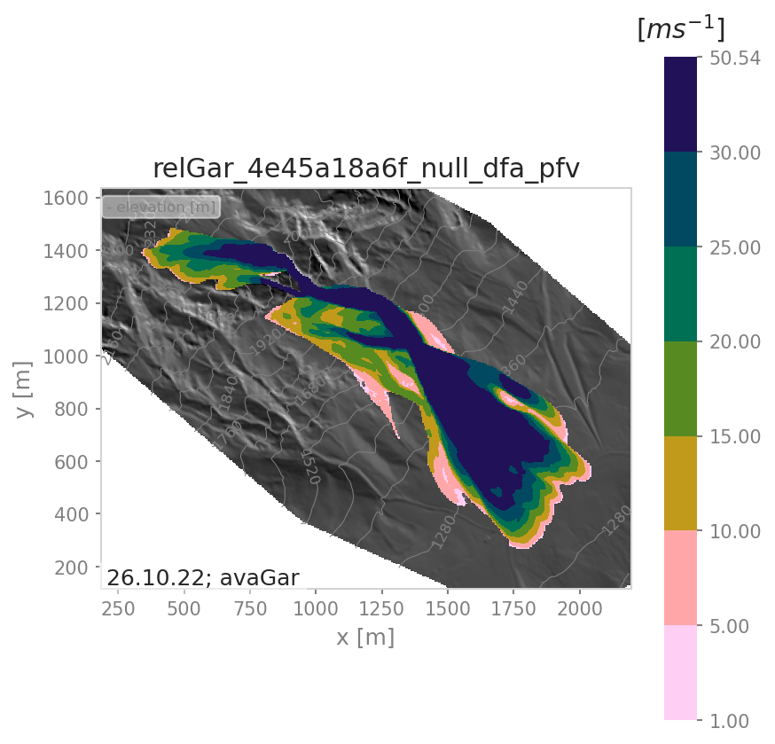 
 
 
##### Figure:   ppr 
 
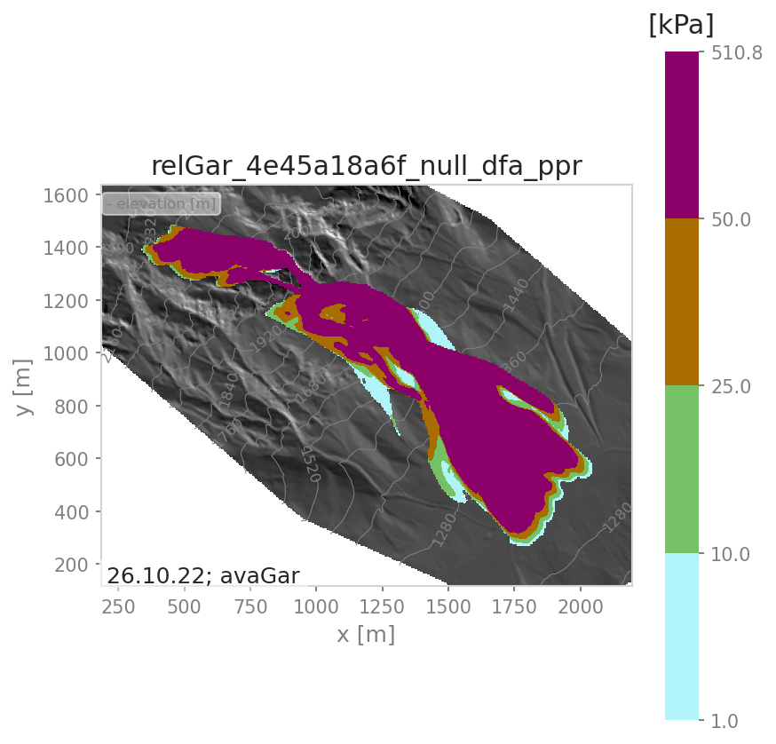 
 
 
# com1DFA Simulation 
 
### Avalanche directory: *data/avaGar* 
 
### Simulation name: *relGar2_17077b1258_ent_dfa* 
 
### Date: 26/10/2022 15:21:19 
 
### Simulation Parameters 
 
| Parameters | Values | 
| ---------- | ------ | 
| Program version | 1.3+6.g1e78e33a.dirty | 
| Parameter set |  | 
| Release Area Scenario | relGar2 | 
| Entrainment | Yes | 
| Resistance | No | 
| Parameter variation on |  | 
| Parameter value |  | 
| Mu | 0.155 | 
| Density [kgm-3] | 200 | 
| Friction model | samosAT | 
| Initial mass [kg] | 66687983.76 | 
| Final mass [kg] | 91265285.42 | 
| Entrained mass [kg] | 2590482.68 | 
| Entrained volume [m3] | 25904.83 | 
| Stop criterion | < 1.00 percent of PKE | 
| Avalanche run time [s] | 101.00 | 
| Computation time [s] | 216.76 | 
 
### Release Area 
 
| Release area scenario | Release Area | Release thickness [m] | Projected Area [m2] | Actual Area [m2] | 
| ----------| ----------| ----------| ----------| ----------| 
| relGar2 | ['GaR2'] | [1.5] | 179250.00 | 232067.28 | 
 
### Entrainment area 
 
| Entrainment area scenario | Entrainment thickness [m] | Entrainment density [kgm-3] | 
| ----------| ----------| ----------| 
| entGar.shp | [0.3] | 100 | 
 
### Simulation Results 
 
##### Figure:   pft 
 
 
 
 
##### Figure:   pfv 
 
 
 
 
##### Figure:   ppr 
 
 
 
 
# com1DFA Simulation 
 
### Avalanche directory: *data/avaGar* 
 
### Simulation name: *relGar2_f206c1bbc0_null_dfa* 
 
### Date: 26/10/2022 15:25:00 
 
### Simulation Parameters 
 
| Parameters | Values | 
| ---------- | ------ | 
| Program version | 1.3+6.g1e78e33a.dirty | 
| Parameter set |  | 
| Release Area Scenario | relGar2 | 
| Entrainment | No | 
| Resistance | No | 
| Parameter variation on |  | 
| Parameter value |  | 
| Mu | 0.155 | 
| Density [kgm-3] | 200 | 
| Friction model | samosAT | 
| Initial mass [kg] | 66687983.76 | 
| Final mass [kg] | 88674802.73 | 
| Entrained mass [kg] | 0.00 | 
| Entrained volume [m3] | 0.00 | 
| Stop criterion | < 1.00 percent of PKE | 
| Avalanche run time [s] | 101.40 | 
| Computation time [s] | 219.48 | 
 
### Release Area 
 
| Release area scenario | Release Area | Release thickness [m] | Projected Area [m2] | Actual Area [m2] | 
| ----------| ----------| ----------| ----------| ----------| 
| relGar2 | ['GaR2'] | [1.5] | 179250.00 | 232067.28 | 
 
### Simulation Results 
 
##### Figure:   pft 
 
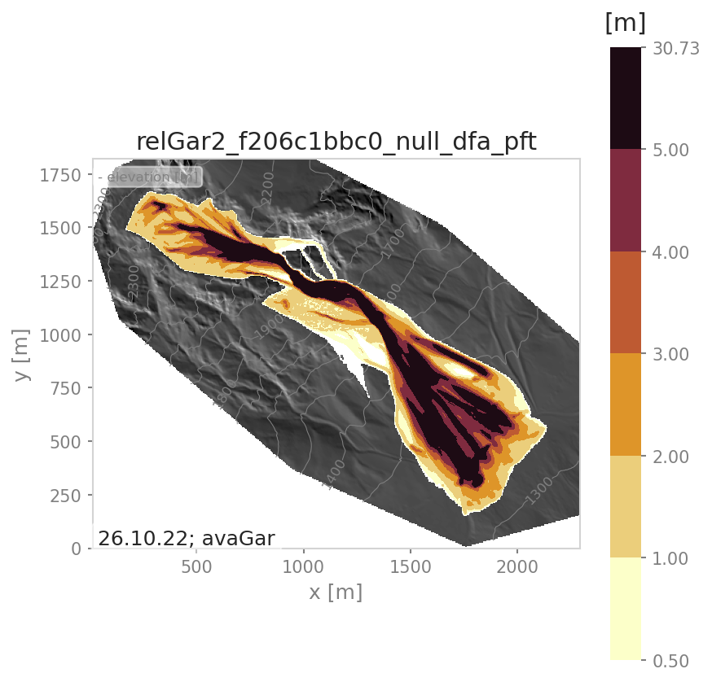 
 
 
##### Figure:   pfv 
 
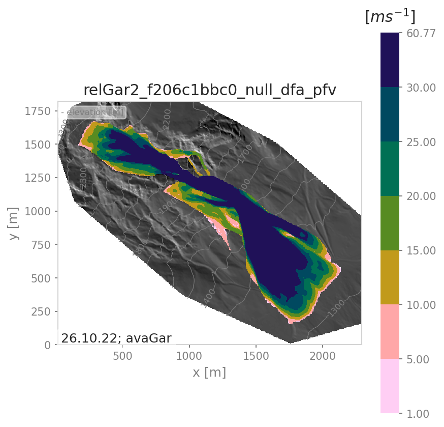 
 
 
##### Figure:   ppr 
 
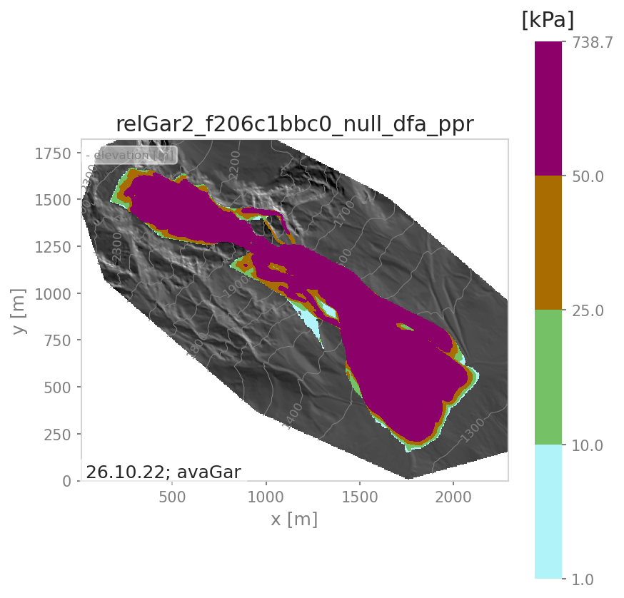 
 
 
# com1DFA Simulation 
 
### Avalanche directory: *data/avaGar* 
 
### Simulation name: *relGar6_9b9013e6ad_ent_dfa* 
 
### Date: 26/10/2022 15:25:42 
 
### Simulation Parameters 
 
| Parameters | Values | 
| ---------- | ------ | 
| Program version | 1.3+6.g1e78e33a.dirty | 
| Parameter set |  | 
| Release Area Scenario | relGar6 | 
| Entrainment | Yes | 
| Resistance | No | 
| Parameter variation on |  | 
| Parameter value |  | 
| Mu | 0.155 | 
| Density [kgm-3] | 200 | 
| Friction model | samosAT | 
| Initial mass [kg] | 21986818.98 | 
| Final mass [kg] | 23730842.18 | 
| Entrained mass [kg] | 1744023.20 | 
| Entrained volume [m3] | 17440.23 | 
| Stop criterion | < 1.00 percent of PKE | 
| Avalanche run time [s] | 95.60 | 
| Computation time [s] | 41.03 | 
 
### Release Area 
 
| Release area scenario | Release Area | Release thickness [m] | Projected Area [m2] | Actual Area [m2] | 
| ----------| ----------| ----------| ----------| ----------| 
| relGar6 | ['GaR6'] | [1.0] | 85275.00 | 116254.45 | 
 
### Entrainment area 
 
| Entrainment area scenario | Entrainment thickness [m] | Entrainment density [kgm-3] | 
| ----------| ----------| ----------| 
| entGar.shp | [0.3] | 100 | 
 
### Simulation Results 
 
##### Figure:   pft 
 
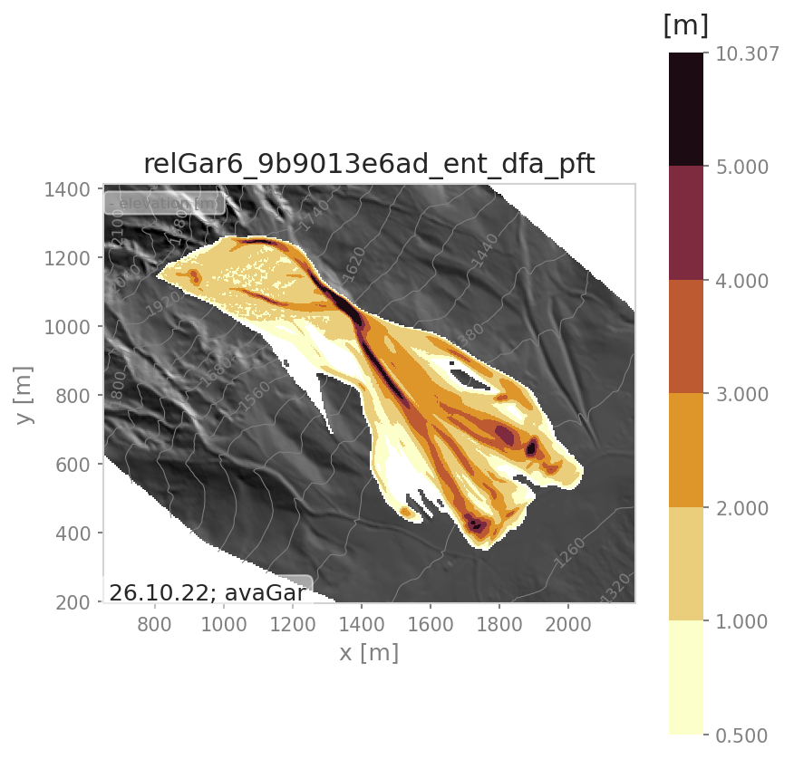 
 
 
##### Figure:   pfv 
 
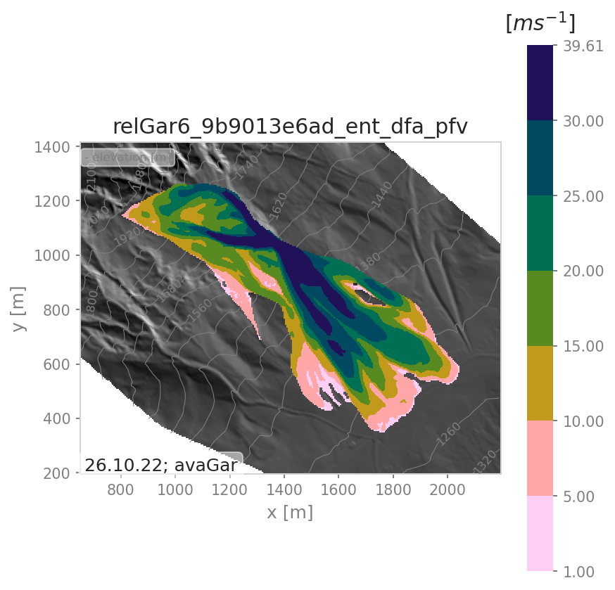 
 
 
##### Figure:   ppr 
 
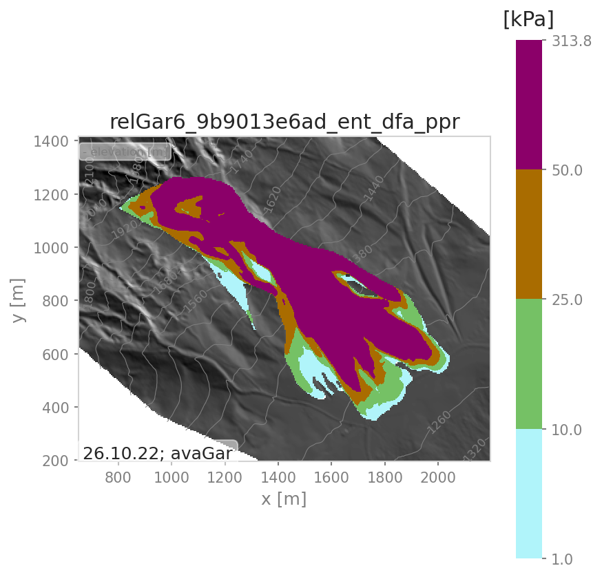 
 
 
# com1DFA Simulation 
 
### Avalanche directory: *data/avaGar* 
 
### Simulation name: *relGar6_5c4d5b0c28_null_dfa* 
 
### Date: 26/10/2022 15:26:23 
 
### Simulation Parameters 
 
| Parameters | Values | 
| ---------- | ------ | 
| Program version | 1.3+6.g1e78e33a.dirty | 
| Parameter set |  | 
| Release Area Scenario | relGar6 | 
| Entrainment | No | 
| Resistance | No | 
| Parameter variation on |  | 
| Parameter value |  | 
| Mu | 0.155 | 
| Density [kgm-3] | 200 | 
| Friction model | samosAT | 
| Initial mass [kg] | 21986818.98 | 
| Final mass [kg] | 21986818.98 | 
| Entrained mass [kg] | 0.00 | 
| Entrained volume [m3] | 0.00 | 
| Stop criterion | < 1.00 percent of PKE | 
| Avalanche run time [s] | 96.60 | 
| Computation time [s] | 40.16 | 
 
### Release Area 
 
| Release area scenario | Release Area | Release thickness [m] | Projected Area [m2] | Actual Area [m2] | 
| ----------| ----------| ----------| ----------| ----------| 
| relGar6 | ['GaR6'] | [1.0] | 85275.00 | 116254.45 | 
 
### Simulation Results 
 
##### Figure:   pft 
 
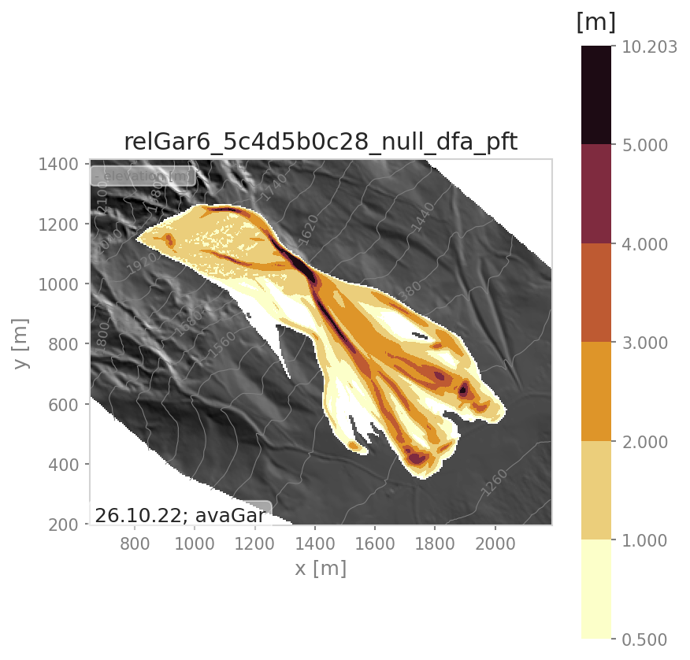 
 
 
##### Figure:   pfv 
 
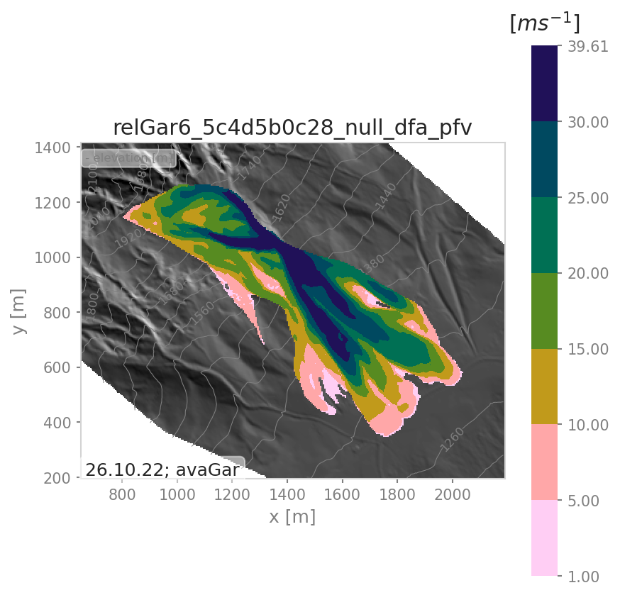 
 
 
##### Figure:   ppr 
 
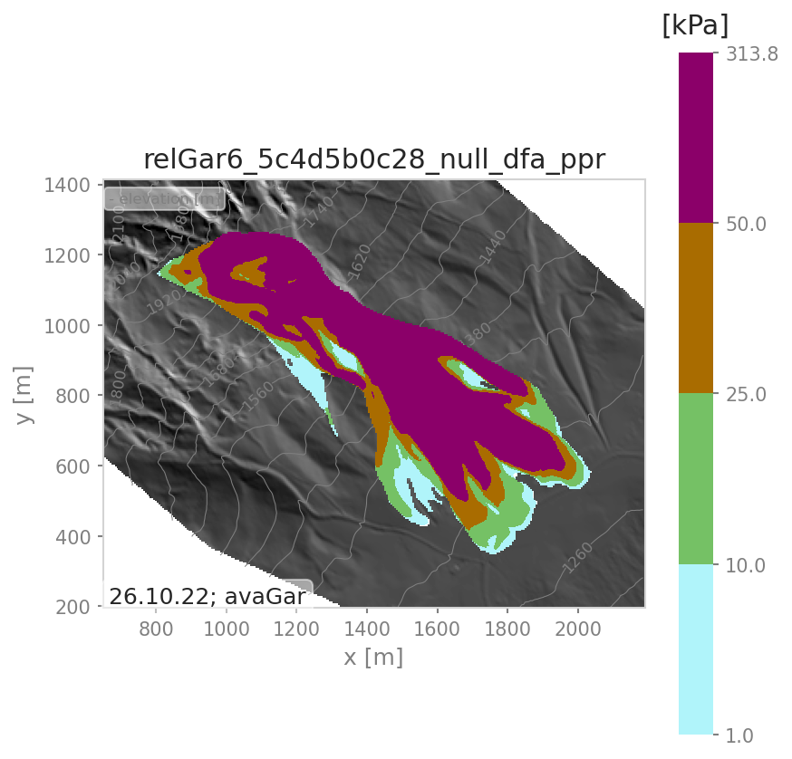 
 
 
