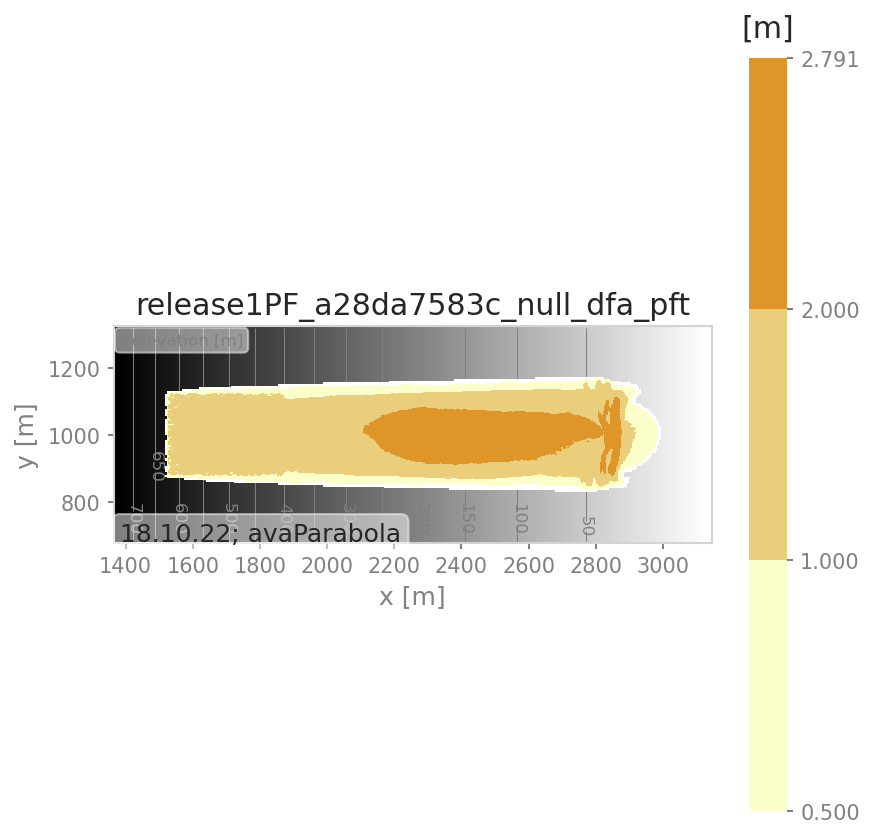

# com1DFA Simulation 
 
### Avalanche directory: *data/avaParabola* 
 
### Simulation name: *release1PF_a28da7583c_null_dfa* 
 
### Date: 18/10/2022 16:58:29 
 
### Simulation Parameters 
 
| Parameters | Values | 
| ---------- | ------ | 
| Program version | 1.3+6.g1e78e33a | 
| Parameter set |  | 
| Release Area Scenario | release1PF | 
| Entrainment | No | 
| Resistance | No | 
| Parameter variation on |  | 
| Parameter value |  | 
| Mu | 0.155 | 
| Density [kgm-3] | 200 | 
| Friction model | samosAT | 
| Initial mass [kg] | 20672345.03 | 
| Final mass [kg] | 20672345.03 | 
| Entrained mass [kg] | 0.00 | 
| Entrained volume [m3] | 0.00 | 
| Stop criterion | < 1.00 percent of PKE | 
| Avalanche run time [s] | 155.70 | 
| Computation time [s] | 63.45 | 
 
### Release Area 
 
| Release area scenario | Release Area | Release thickness [m] | Projected Area [m2] | Actual Area [m2] | 
| ----------| ----------| ----------| ----------| ----------| 
| release1PF | ['Rel_Example'] | [1.0] | 89250.00 | 106444.44 | 
 
### Simulation Results 
 
##### Figure:   pft 
 
 
 
 
##### Figure:   pfv 
 
 
 
 
##### Figure:   ppr 
 
 
 
 
# com1DFA Simulation 
 
### Avalanche directory: *data/avaParabola* 
 
### Simulation name: *release1PF_cad6a6d628_res_dfa* 
 
### Date: 18/10/2022 16:59:36 
 
### Simulation Parameters 
 
| Parameters | Values | 
| ---------- | ------ | 
| Program version | 1.3+6.g1e78e33a | 
| Parameter set |  | 
| Release Area Scenario | release1PF | 
| Entrainment | No | 
| Resistance | Yes | 
| Parameter variation on |  | 
| Parameter value |  | 
| Mu | 0.155 | 
| Density [kgm-3] | 200 | 
| Friction model | samosAT | 
| Initial mass [kg] | 20672345.03 | 
| Final mass [kg] | 20672345.03 | 
| Entrained mass [kg] | 0.00 | 
| Entrained volume [m3] | 0.00 | 
| Stop criterion | < 1.00 percent of PKE | 
| Avalanche run time [s] | 158.50 | 
| Computation time [s] | 65.51 | 
 
### Release Area 
 
| Release area scenario | Release Area | Release thickness [m] | Projected Area [m2] | Actual Area [m2] | 
| ----------| ----------| ----------| ----------| ----------| 
| release1PF | ['Rel_Example'] | [1.0] | 89250.00 | 106444.44 | 
 
### Resistance area 
 
| Resistance area scenario | 
| ----------| 
| resistance1PF.shp | 
 
### Simulation Results 
 
##### Figure:   pft 
 
 
 
 
##### Figure:   pfv 
 
 
 
 
##### Figure:   ppr 
 
 
 
 
